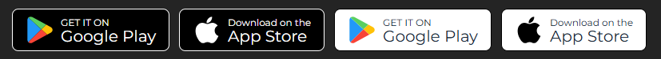

# React AppStore GooglePlay Buttons

A simple React component to display download buttons for Google Play and the App Store, with support for light/dark themes and customizable/localized text.

## 🖼 Visual Example



## 🚀 Installation

Using npm:

```bash
npm install react-appstore-googleplay-buttons

Or with yarn:

yarn add react-appstore-googleplay-buttons

📾 Usage

import StoreButton from 'react-appstore-googleplay-buttons';

<StoreButton
  store="Google Play"
  theme="dark"
  text="GET IT ON"
  googlePlayPackageId="your.googlePlay.package"
/>

<StoreButton
  store="App Store"
  theme="dark"
  text="Download on the"
  appStoreAppId="yourAppStoreAppId"
/>

<StoreButton
  store="Google Play"
  theme="light"
  text="GET IT ON"
  googlePlayPackageId="your.googlePlay.package"
/>

<StoreButton
  store="App Store"
  theme="light"
  text="Download on the"
  appStoreAppId="yourAppStoreAppId"
/>


⚙️ Props

Prop | Type | Description
store | string | "Google Play" or "App Store"
theme | string | "light" or "dark"
text | string | Text to display above the store name (e.g., "GET IT ON")
googlePlayPackageId | string | (required for Google Play) Android package ID
appStoreAppId | string | (required for App Store) iOS App ID

🌍 Localization
You can pass a pre-localized string or a custom label for the button text.

🧑‍💻 Author
Alberto Bovi 📧 alberto.bovi@gmail.com 🌐

MIT License